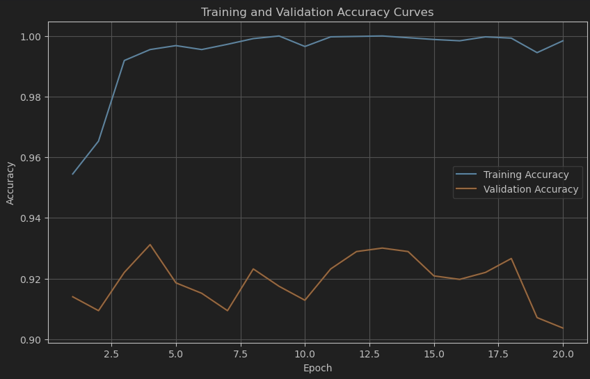
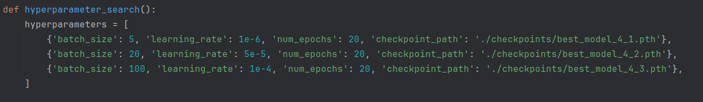

# Write-up

## 1.2.3

A transformer’s attention mechanism can “copy” or “re-use” the most relevant tokens by giving them high attention weight. In language modeling, this is highly valuable because the model often needs to reproduce or refer to words or phrases from the recent context (e.g., entity names, rare tokens, or repeating phrases). Being able to “copy” directly helps maintain consistency and coherence in generated text, especially for longer contexts or structured repetitions.

## 1.3.3

In a language‐modeling context, the model often needs to combine information from multiple tokens e.g. when resolving a reference that depends on multiple clues, or when synthesizing context from multiple parts of a sentence or paragraph. Ability to average allows it to be more precise, as it can combine previously seen data into new output and information.

## 1.4.3

Altering $k_2$ changes its dot product with the query, which modifies the unnormalized attention scores for all tokens. Even if the query originally favored the first two tokens, increasing $q \cdot k_2$ causes the softmax to assign a higher weight to token 2, drawing attention away from tokens 0 and 1. This is because the softmax is sensitive to the relative differences between all dot products, so an increase in $q \cdot k_2$ can significantly shift the overall attention distribution and impact the final output.

## 2.2.2

{ width=50% }

## 2.2.3

Looking at the accuracy graphs, it is clear that model is overfitting to training data after epoch 5, giving no increase in accuracy in next epochs, with some random fluctutions. It is even better confirmed with the best validation accuracy being achieved at epoch 4.

## 2.2.4

{ width=80% }

<!-- ```python -->
<!-- hyperparameters = [ -->
<!--         {'batch_size': 5, 'learning_rate': 1e-6, 'num_epochs': 20, 'checkpoint_path': './checkpoints/best_model_4_1.pth'}, -->
<!--         {'batch_size': 20, 'learning_rate': 5e-5, 'num_epochs': 20, 'checkpoint_path': './checkpoints/best_model_4_2.pth'}, -->
<!--         {'batch_size': 100, 'learning_rate': 1e-4, 'num_epochs': 20, 'checkpoint_path': './checkpoints/best_model_4_3.pth'}, -->
<!--     ] -->
<!-- ``` -->

I tried these hyperparameters.

The first thing I tried is decreasing batch size, since it would allow to fine-tune the model better (better learning for individual tokens), as well as decrease learning rate, since we saw weird fluctuations in accuracy with default params.

Second attempt is a less aggressive decrease in batch size and lr. To check in the middle to see if I am moving in the right direction, but maybe too far.

Third attempt is checking another hypothesis - that the model gets overfitted too much, so I tried increasing batch size, which should lead to better generalization.

## 2.2.5

Best model hyperparameters:

Optimizer: AdamW

Batch size: 5

Learning rate: 1e-06

Number of epochs: 20

Final model performance:

Training accuracy: 0.9792

Validation accuracy: 0.9278

Test accuracy: 0.9467
